## Lost and Found System Project

This project is a Lost and Found System developed with Laravel 11, designed to help students and staff report lost or found items and coordinate item recovery within a university or community environment.
Users can post lost or found items, upload images, and specify locations using the Google Maps API, while managing their own posts through a secure user dashboard. Administrators can monitor, search, and manage all items within the system.
The system utilizes Laravel Jetstream and Sanctum for authentication and security, MySQL for data storage, and Tailwind CSS for a clean and responsive user interface.
(System-oriented web application project)

## Screenshots

### 1. Login Page
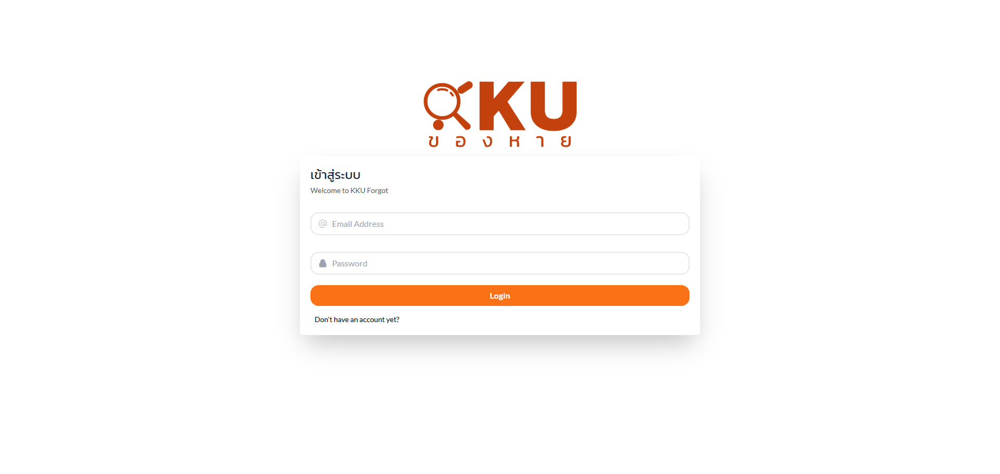

### 2. Register Page
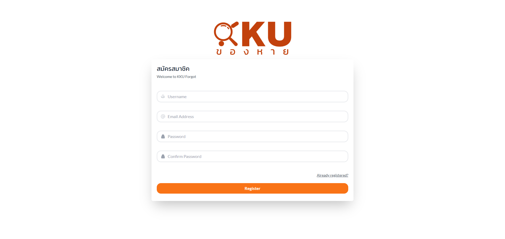

### 3. Main Dashboard
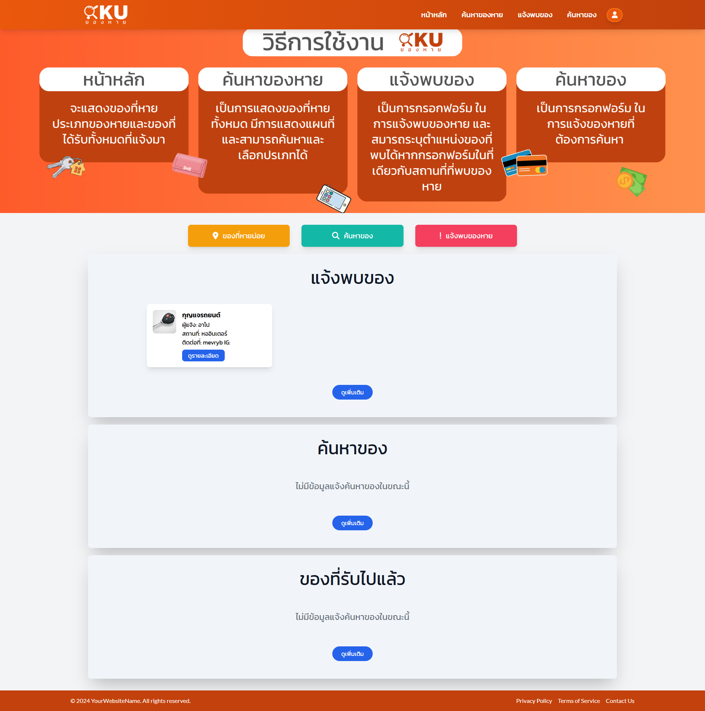

### 4. Found Items
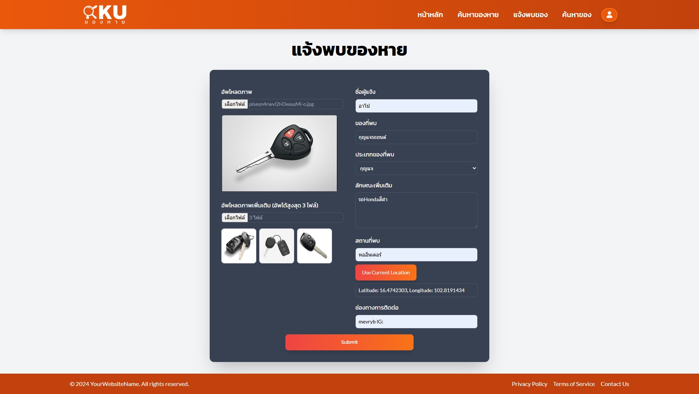

### 5. Missing Items
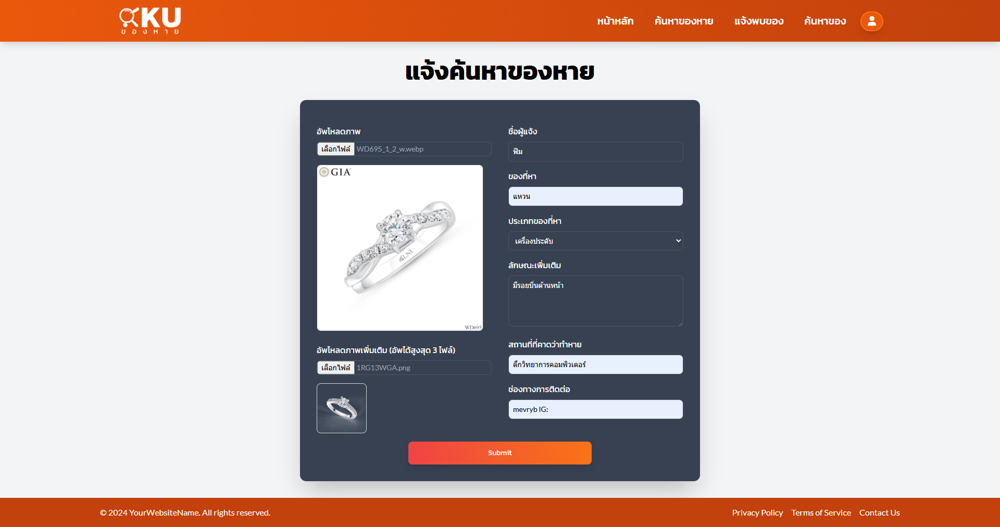

### 6. Item Detail
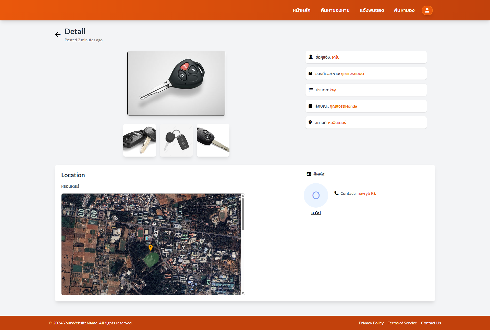

### 6.2. Item Detail with Pin Location
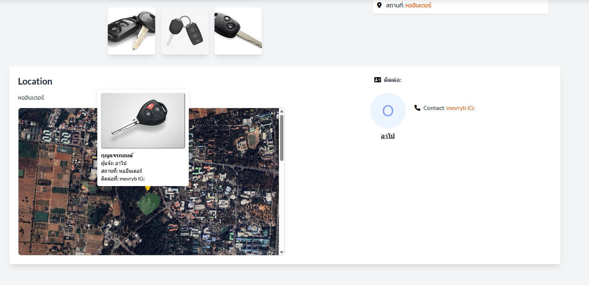

### 7. Map View
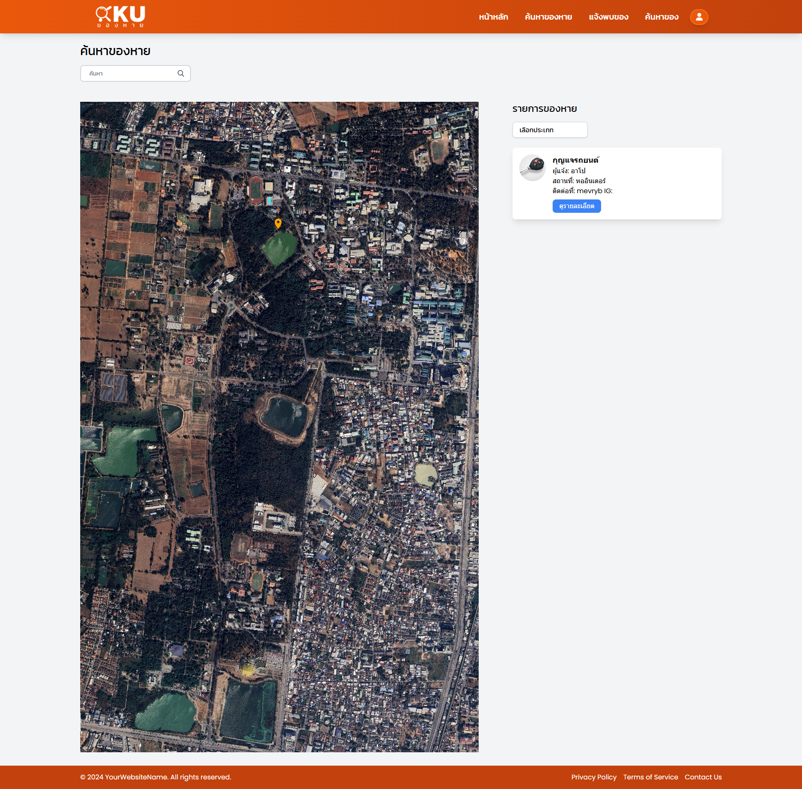

### 7.2. Map with Pin Locations
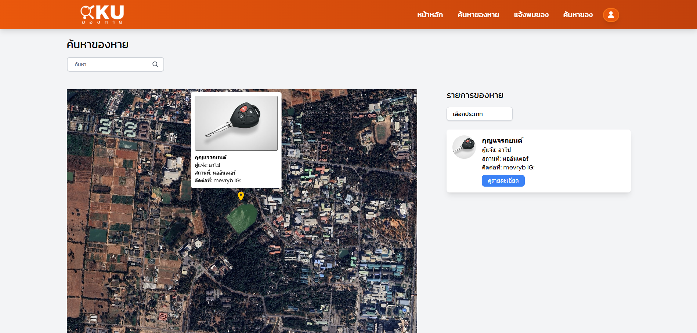

### 8. User Profile
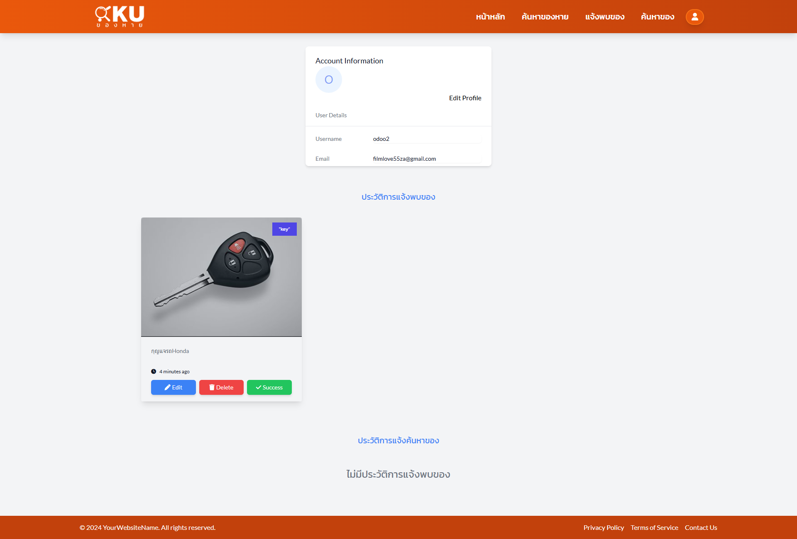

### 9. Admin Dashboard
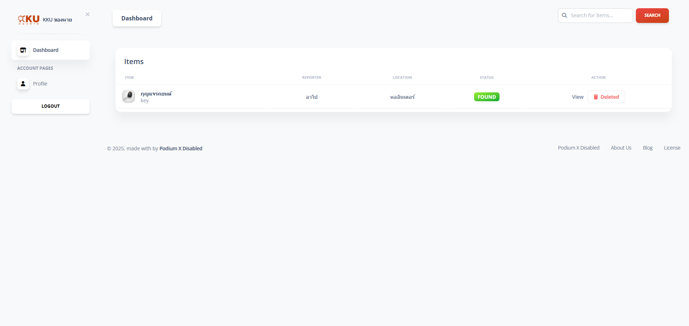

### 10. Admin Items Management
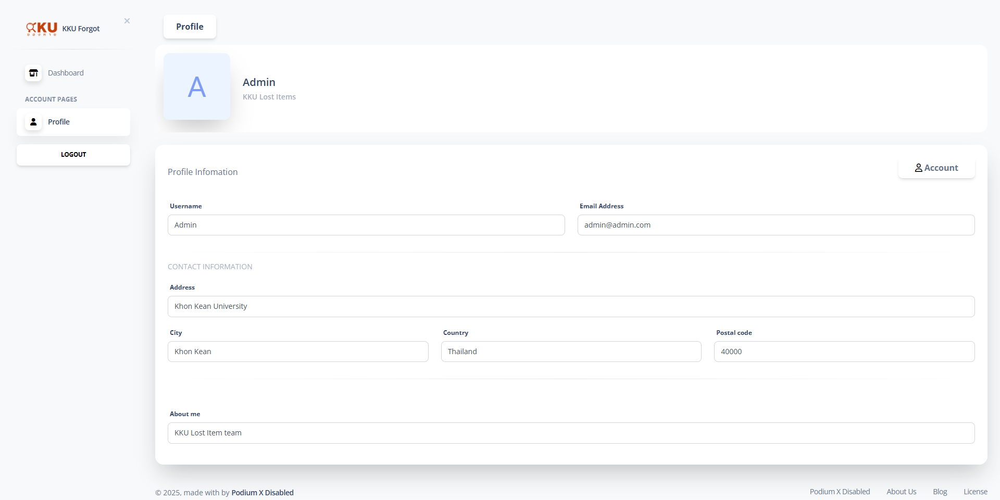

